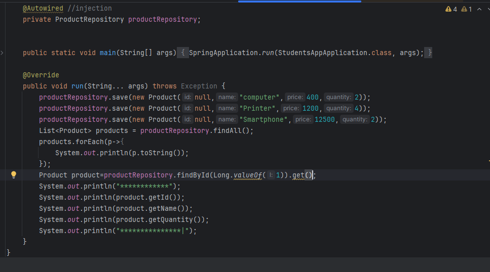
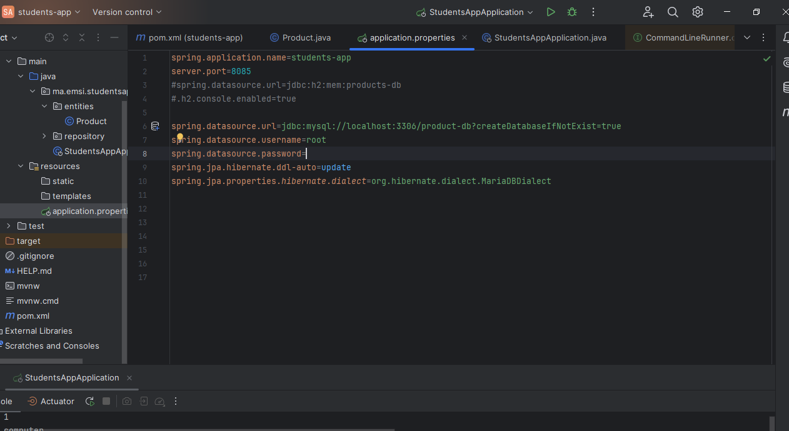
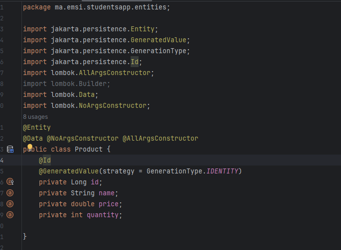
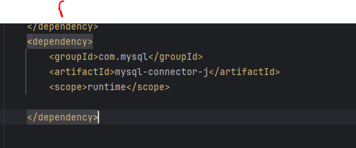
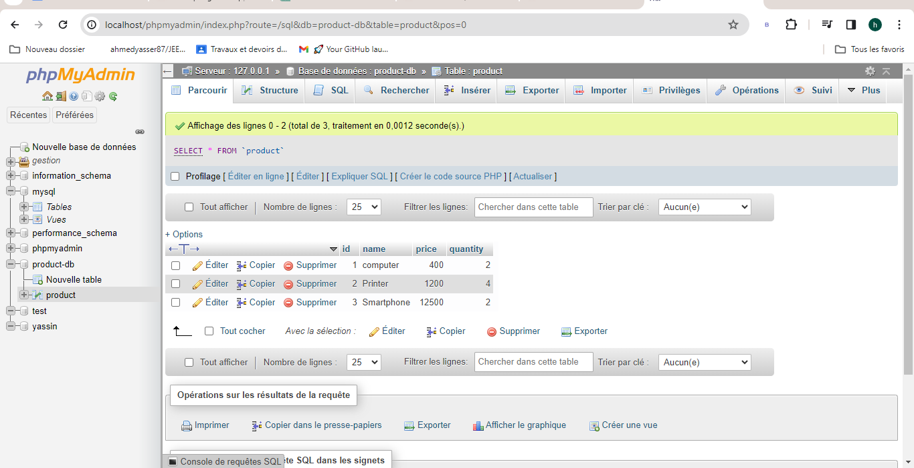

<h3>compte rendu <h3>
<h10>ajouter l entite produit<h10>

<h10>application_proprietes<h10>

<h10>Configurer l'unité de persistance dans le ficher application.properties<h10>

<h10>creer_entite_jpa_product<h10>

<h10>etape_migrationt<h10>

<h10>migrationvers_mysql<h10>

